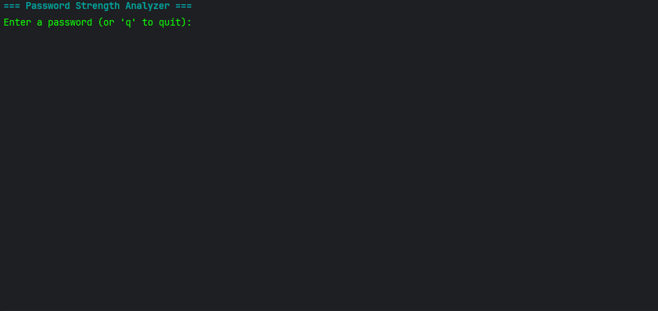

# Password Strength Analyzer (Java)

This is a small Java project I built for fun to practice OOP and get more comfortable with Java. 
It analyzes a password and gives you a score from 0–100, a strength rating, and feedback on how to improve it. 
Everything runs in the console, and the output is color coded to make it look nicer.

---

## Demo



---

## Features
- Scores passwords based on:
    - length
    - uppercase/lowercase
    - numbers
    - symbols
    - repeated characters
    - common password list
- Gives friendly feedback on how to make the password stronger
- Colorized console output using ANSI colors
- Simple OOP structure

---

## How to Run
1. Clone the repo:
   ```bash
   git clone https://github.com/sleepyhugo/password-strength-analyzer.git

2. Open the project in IntelliJ (or any Java IDE).

3. Run the PasswordStrengthApp class.